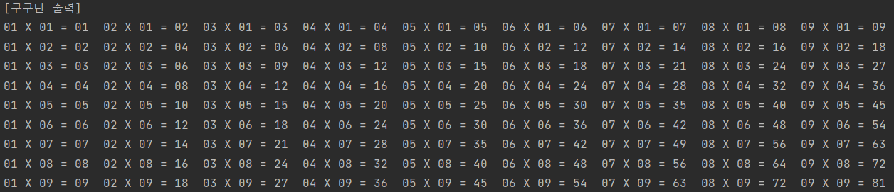

# 1.1 콘솔 화면에 구구단 출력하기

---
**목적**
-  Java `다중 반복문 사용`, `format` 함수를 이용하여 주어진 조건에 맞는 로직을 작성하기

---
**요구사항**

- 반복문을 사용하여 구구단을 화면에 출력하는 프로그램 작성한다.
- 다중 반복문 사용
- 콘솔화면에 내용이 맞도록 format 함수 사용
- 1단부터 9단까지 표시

---
**권장사항**
- String.format 함수 학습
- 반복문에 대한 초기값은 주어진 조건에 맞게 작성한다.

**배운점**

```java
public class Main {
    public static void gugudan() {
        System.out.println("[구구단 출력]");
        for(int i = 1; i <= 9; i++){
            for(int j = 1; j <= 9; j++){
                // 10보다 작은 경우 앞에 0을 붙여 출력한다.
                if (i * j < 10) {
                    System.out.printf("0%d X 0%d = 0%d  ", j, i, i * j);
                }
                else {
                    System.out.printf("0%d X 0%d = %d  ", j, i, i * j);
                }
            }
            System.out.println();
        }
    }

    public static void main(String[] args) {
        gugudan();
    }
}

```

String.format 함수 사용하기
- String.format을 사용해서 숫자와 비교해 앞에 0을 채울 수 있다.

```java
public class Main {
    public static void gugudan() {
        System.out.println("[구구단 출력]");
        for(int i = 1; i <= 9; i++){
            for(int j = 1; j <= 9; j++){
                // 10보다 작은 경우 앞에 0을 붙여 출력한다.
                System.out.printf("%02d X %02d = %02d  ", j, i, i * j);
            }
            System.out.println();
        }
    }

    public static void main(String[] args) {
        gugudan();
    }
}
```

**출력결과**
